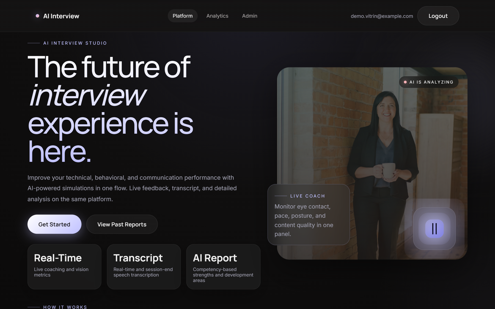
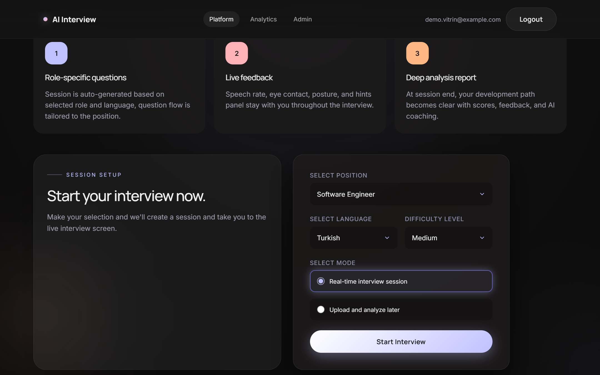
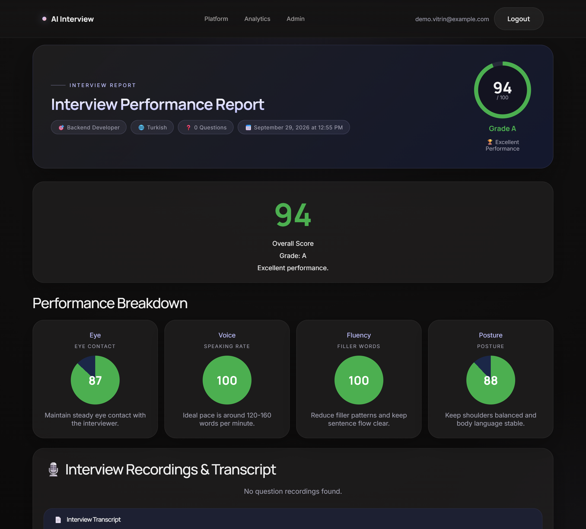
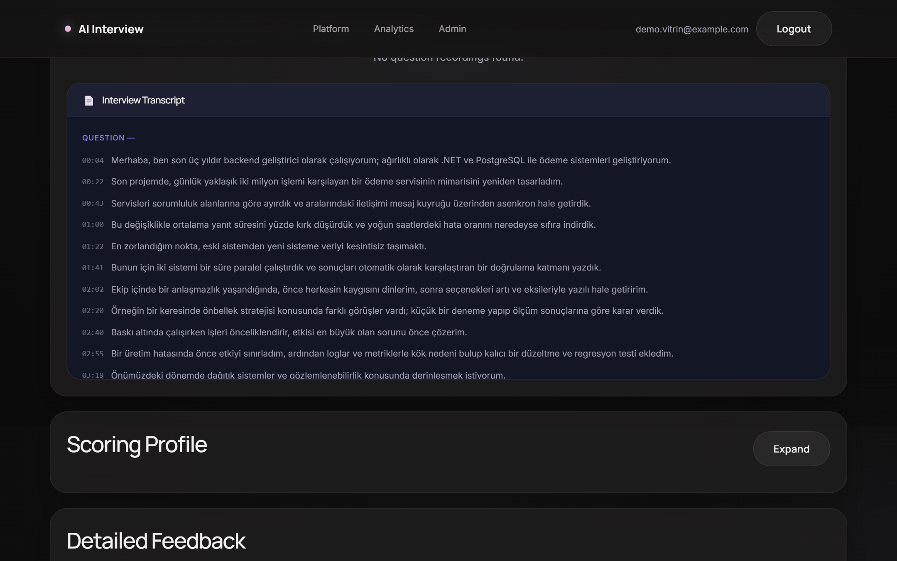
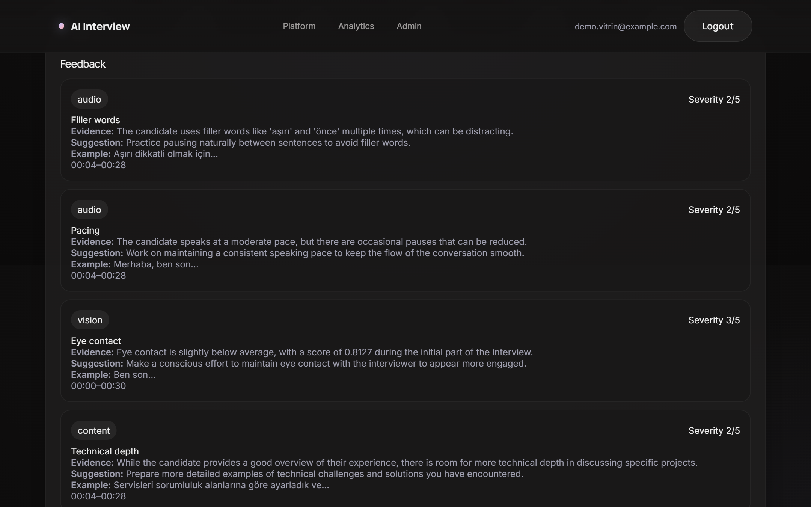
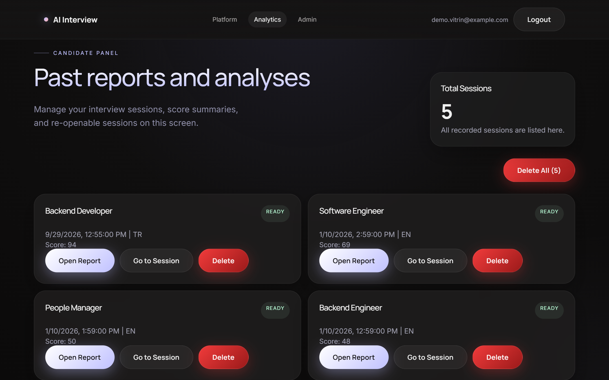

# AI Interview Coach — Yapay Zekâ Destekli Mülakat Koçu

> Adayların gerçekçi bir iş mülakatını kamera karşısında prova ettiği; göz teması, duruş, konuşma ve cevap içeriğini analiz edip kişiye özel gelişim raporu sunan bir mülakat hazırlık platformu. Yapay zekâ tamamen **yerelde** çalışır, mülakat verisi dışarı çıkmaz.



---

## Hangi sorunu çözüyor?

Adaylar mülakata çoğunlukla aynada ya da hiç prova yapmadan girer; neyi yanlış yaptıklarını ancak olumsuz bir sonuçtan sonra tahmin ederler. İşe alım ekipleri de adayların iletişim becerilerini geliştirecek ölçeklenebilir bir araçtan yoksundur.

AI Interview Coach, bir mülakatı baştan sona simüle eder ve sonunda **somut, ölçülebilir ve kanıta dayalı** geri bildirim verir:

```
Pozisyon seç → Kamera karşısında mülakat → Canlı analiz → Oturum sonu rapor → Yapay zekâ koçluğu
```

## Kimler için?

| | Kullanım |
|---|---|
| 🎓 **Adaylar ve yeni mezunlar** | Gerçek mülakattan önce güvenli bir ortamda prova yapmak |
| 🏢 **İK ve işe alım ekipleri** | Aday deneyimini iyileştirmek, ön görüşmelere hazırlık aracı sunmak |
| 🎯 **Kariyer merkezleri ve bootcamp'ler** | Çok sayıda öğrenciye ölçeklenebilir mülakat pratiği sağlamak |

## Öne çıkan özellikler

| | Özellik | Ne işe yarar? |
|---|---|---|
| 💬 | **Pozisyona özel sorular** | Seçilen rol, dil ve zorluk seviyesine göre soru akışı oluşturulur; ilk cevaplara göre sonraki sorular uyarlanır (adaptif mülakat). |
| 📹 | **Kamera ve ekran kaydı** | Her soru ayrı bir video olarak kaydedilir; aday sonradan kendi cevaplarını izleyebilir. |
| 👁️ | **Beden dili analizi** | Göz teması, duruş, kıpırdanma ve baş hareketleri tarayıcıda gerçek zamanlı ölçülür. |
| 🗣️ | **Konuşma analizi** | Tüm cevaplar Türkçe dahil yüksek doğrulukla yazıya dökülür; transkriptten konuşma hızı (kelime/dakika) ve "ee, şey, yani" gibi dolgu ifadeleri ölçülür. |
| 🤖 | **Yapay zekâ koçu** | Transkript ve metrikler yerel bir dil modeliyle değerlendirilir; her geri bildirim **kanıt, öneri, örnek ve zaman aralığıyla** birlikte gelir. |
| 📊 | **Detaylı rapor** | Genel puan, yetkinlik bazlı kırılım, transkript ve çalışma önerileri tek sayfada; JSON / Markdown olarak dışa aktarılabilir. |
| 🔒 | **Gizlilik öncelikli** | Yapay zekâ modelleri yerelde çalışır; kayıtlar belirlenen süre sonunda otomatik silinir (veri saklama politikası). |

## Ekran görüntüleri

### Mülakat kurulumu
Pozisyon, dil, zorluk seviyesi ve mod (canlı mülakat ya da kaydı sonradan yükleyip analiz ettirme) seçilir.



### Performans raporu
Genel puan ve göz teması, konuşma hızı, akıcılık, duruş kırılımı.



### Zaman damgalı transkript
Adayın tüm cevapları, mülakat içindeki zamanlarıyla birlikte.



### Yapay zekâ koçu
Her geri bildirim; kategori, önem derecesi, **kanıt**, **somut öneri** ve transkriptten örnekle birlikte sunulur.



### Geçmiş raporlar
Aday tüm oturumlarını ve puanlarını tek ekranda görür, gelişimini takip eder.



---

## Tasarım ilkeleri

- **Kanıta dayalı geri bildirim.** "Daha iyi iletişim kurun" gibi genel tavsiyeler yerine, her yorum transkriptteki bir ana ve ölçülen bir metriğe bağlanır.
- **Gizlilik.** Konuşma tanıma (faster-whisper) ve dil modeli (Ollama) kullanıcının kendi makinesinde çalışır; hiçbir bulut yapay zekâ servisine veri gönderilmez.
- **Veri minimizasyonu.** Yapılandırılabilir saklama politikası ile eski kayıtlar otomatik olarak silinir (varsayılan: 30 gün); yönetici panelinden durumu izlenir ve elle tetiklenebilir.

## Teknik altyapı

| Katman | Teknoloji |
|---|---|
| Frontend | React 18, TypeScript, Vite |
| Backend | .NET 8 Web API, Entity Framework Core |
| Veritabanı | PostgreSQL 16 |
| Konuşma tanıma | faster-whisper (`large-v3-turbo`), Python servisi |
| Dil modeli | Ollama (`qwen2.5:7b-instruct`), yerel |
| Görüntü analizi | MediaPipe FaceLandmarker + PoseLandmarker (tarayıcıda) |
| Dağıtım | Docker Compose (NVIDIA GPU desteği opsiyonel) |

```
Tarayıcı (React + MediaPipe)
  ├── Backend API (.NET 8) ── PostgreSQL
  │        └── Ollama (yerel LLM)
  └── Speech Service (faster-whisper)
```

## Çalıştırma

Gereksinimler: Docker Desktop · önerilen: NVIDIA GPU

```bash
cp .env.example docker/.env
cd docker
docker compose up -d
docker exec -it $(docker ps -qf "name=ollama") ollama pull qwen2.5:7b-instruct
```

İlk çalıştırmada konuşma tanıma modeli indirilir (~1.5 GB).

- Uygulama: http://localhost:5173
- API: http://localhost:8080

Ayrıntılar: [Mimari](docs/architecture.md) · [Operasyon rehberi](docs/OPERATIONS_RUNBOOK.md) · [Gizlilik](docs/privacy.md) · [Katkı rehberi](CONTRIBUTING.md)

---

*Ekran görüntülerindeki mülakat oturumu kurgusal demo verisidir.*
